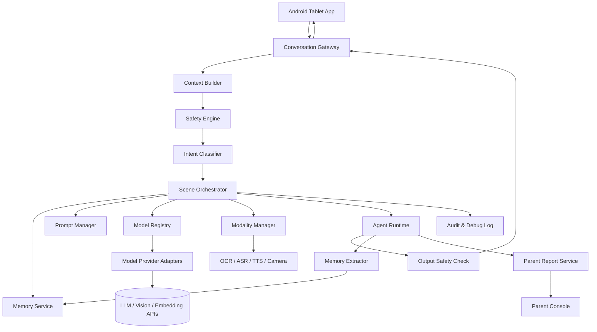

# 儿童 AI 成长智能体 v0.1 系统设计文档

版本：v0.1 Draft  
定位：Codex 开发项目起始设计文档  
目标用户：父亲 / 开发者、8 岁二年级儿童  
核心形态：安卓平板上的卡通 AI 成长智能体  

---

## 0. 文档目标

本文档用于把当前已经确定的产品思路、系统边界、技术架构和第一版开发目标落实为可执行的工程设计。

v0.1 的目标不是做一个“大而全”的儿童 AI 产品，而是先做出一个安全、可控、可扩展、可持续迭代的儿童 AI 智能体框架。这个框架后续可以逐步扩展出更多场景、更多模型、更多多模态能力和更丰富的成长支持功能。

最新产品方向修订：系统底座应是小白狐与孩子的自由交流，而不是固定任务场景集合。`conversation.open` 是默认模式；时间、父母寄语、记忆、最近聊天和多模态能力作为上下文或工具注入；高风险安全、隐私边界、明确学习求助、明确睡前收尾和父母强规则作为护栏按需介入。

本项目第一版的核心闭环是：

```text
孩子自然打开 App 和卡通智能体交流
  -> 系统读取当前时间、父母寄语、上下文、父亲目标和孩子记忆
  -> 默认自由对话，必要时按安全/隐私/学习/睡前边界切换护栏
  -> 用合适的方式自然聊天、引导思考或低刺激收尾
  -> 必要时调用语音、图片分享、OCR/视觉等多模态能力
  -> 形成结构化记忆和父亲摘要
  -> 第二天智能体能基于历史更好地理解孩子
```

---

## 1. 产品定位

### 1.1 一句话定义

一个由父亲配置和治理的儿童 AI 成长智能体，通过每天短时、多模态、动态场景化的交流，帮助孩子提升表达力、思考力、学习力、自我管理能力和 AI 素养。

### 1.2 不是做什么

本项目第一版不是：

```text
1. 不是无边界的儿童通用聊天机器人。
2. 不是只服务作业的拍照搜题工具。
3. 不是替孩子写作业的工具。
4. 不是心理咨询产品。
5. 不是儿童社交产品。
6. 不是通过游戏化机制延长屏幕时间的产品。
7. 不是父母监控孩子每句话的工具。
```

### 1.3 是做什么

本项目第一版是：

```text
1. 儿童成长教练。
2. 学习思维脚手架。
3. 表达练习伙伴。
4. 每日复盘助手。
5. 父亲教育目标的执行器。
6. 儿童长期成长记忆系统。
7. 可插拔模型和场景框架。
```

### 1.4 核心产品原则

```text
1. 孩子端只有一个统一智能体入口。
2. 默认自由对话；场景切换只在安全、隐私、学习、睡前收尾等明确触发时介入。
3. AI 有卡通形象，但不制造情感依赖。
4. AI 能聊天，但每次聊天应有目标和收尾。
5. AI 能辅导学习，但默认不直接给答案。
6. AI 有记忆，但不随意贴固定人格标签。
7. 父亲拥有治理权，但系统不应变成高压监控工具。
8. 最终目标是把孩子带向更好的真实生活，而不是把孩子留在屏幕里。
```

---

## 2. 目标儿童画像与设计假设

### 2.1 当前目标儿童

```text
年龄：8 岁
年级：小学二年级
性格特点：偏内向、慢热、不一定主动表达学校里的事
父亲目标：希望通过 AI 技术尽早帮助孩子形成更好的学习方式、思维方式和表达习惯
设备：安卓平板
```

### 2.2 对“内向”的设计定义

系统不把“内向”视为缺陷，也不以“让孩子变外向”为目标。v0.1 的目标是帮助孩子：

```text
1. 更安全地表达自己。
2. 更愿意说出自己的想法。
3. 更能讲清楚一件事情。
4. 更能描述自己的情绪和困难。
5. 更愿意向父母、老师和真实世界求助。
6. 在学习上更能说清楚自己卡在哪里。
```

不允许使用的负向标签：

```text
胆小、不合群、不主动、不聪明、懒、没自信、问题儿童
```

推荐使用观察型描述：

```text
1. 直接问学校经历时回答较短。
2. 使用选择题时更容易开始表达。
3. 兴趣话题能带动更长表达。
4. 数学应用题容易跳过题意复述。
5. 遇到不会的问题时倾向于直接要答案。
```

---

## 3. v0.1 范围定义

### 3.1 v0.1 必须实现

```text
1. 安卓平板儿童端基础聊天界面。
2. 卡通智能体形象占位能力。
3. 文字输入和文本回复。
4. 基础语音输入/输出接口预留，优先实现 Android TTS，可后续接 ASR。
5. 统一会话 API。
6. 当前时间上下文注入。
7. 父亲可配置的作息时间段。
8. 动态场景编排器雏形。
9. 模型 Provider 抽象和可配置模型档案。
10. 基础 Prompt 分层体系。
11. 基础记忆系统。
12. 放学后交流场景。
13. 学习求助场景。
14. 睡前复盘场景。
15. 基础安全分类。
16. 父亲目标配置。
17. 父亲日报生成。
18. 路由决策日志。
```

### 3.2 v0.1 可以暂缓

```text
1. 高质量动画卡通形象。
2. 完整多智能体协作。
3. 完整语音识别和自然语音对话。
4. 大规模向量数据库。
5. 多孩子、多家庭账号体系。
6. 复杂课程规划。
7. 长期学习成绩分析。
8. 应用商店上架。
9. 第三方教育内容接入。
10. 高级游戏化系统。
```

### 3.3 v0.1 不做

```text
1. 不做开放式无限闲聊。
2. 不做陌生人社交。
3. 不做广告。
4. 不做排行榜。
5. 不做完整心理诊断。
6. 不做直接答案机器。
7. 不做隐藏聊天空间。
8. 不做全量原始音频和图片长期保存。
```

---

## 4. 总体架构

### 4.1 架构思想

本系统不是传统功能入口型 App，而是“统一交互入口 + 动态场景编排 + 可插拔模型能力 + 成长记忆系统”。

孩子端永远只看到一个卡通智能体。内部则由场景编排器根据输入内容、当前时间、父亲目标、会话状态和记忆动态切换工作模式。

### 4.2 高层架构图



### 4.3 分层架构

```text
第一层：儿童交互层
  - 卡通形象
  - 聊天气泡
  - 文字输入
  - 语音输入/输出
  - 拍照上传
  - 快捷动作按钮
  - 表情/选项选择

第二层：会话编排层
  - 当前时间段判断
  - 会话状态管理
  - 意图识别
  - 风险识别
  - 场景栈维护
  - 下一步动作决策

第三层：智能能力层
  - LLM 对话
  - 结构化分类
  - OCR
  - 图像理解
  - 语音转文本
  - 文本转语音
  - 记忆抽取
  - 父亲摘要

第四层：成长记忆层
  - 基础档案
  - 兴趣记忆
  - 学习画像
  - 表达特点
  - 情绪事件
  - 社交观察
  - 父亲目标
  - 安全记录

第五层：治理配置层
  - 模型配置
  - Prompt 版本
  - 父亲规则
  - 安全策略
  - 数据保存策略
  - 审计日志
```

---

## 5. 关键模块设计

### 5.1 Android Tablet App

职责：

```text
1. 提供儿童端统一聊天入口。
2. 展示卡通智能体形象。
3. 支持文字输入。
4. 支持语音输入接口预留。
5. 支持 TTS 播放智能体回复。
6. 支持拍照上传题目。
7. 支持快捷动作按钮，例如“拍题目”“读题目”“换个说法”。
8. 支持父亲配置页。
9. 本地缓存会话和设置。
10. 保护 API Key 不进入客户端。
```

推荐技术：

```text
语言：Kotlin
UI：Jetpack Compose
本地数据库：Room / SQLite
本地配置：DataStore
加密：Android Keystore + SQLCipher 或加密字段
相机：CameraX
TTS：Android TextToSpeech
网络：Ktor Client 或 Retrofit
```

### 5.2 Conversation Gateway

职责：

```text
1. 所有孩子输入的统一入口。
2. 接收文本、图片、语音等输入。
3. 标准化输入消息结构。
4. 调用 Context Builder、Safety Engine、Scene Orchestrator 和 Agent Runtime。
5. 返回智能体回复和 UI 动作。
6. 写入会话消息和路由日志。
```

### 5.3 Context Builder

职责：

```text
1. 读取当前设备时间和服务端时间。
2. 判断当前所属时间段。
3. 读取孩子基础档案。
4. 读取父亲目标和沟通偏好。
5. 读取当前会话状态。
6. 检索相关记忆。
7. 构造本轮对话所需上下文。
```

输出示例：

```json
{
  "now": "2026-05-17T16:35:00+08:00",
  "time_period": "after_school",
  "weekday": true,
  "child_profile": {
    "age": 8,
    "grade": "二年级",
    "expression_style": "慢热，直接开放式问题时回答较短"
  },
  "parent_goals": [
    "鼓励孩子每天说一件学校小事",
    "学习问题先引导思路，不直接给答案"
  ],
  "retrieved_memories": [
    "孩子喜欢恐龙和乐高话题",
    "使用选择题更容易让孩子开始表达",
    "数学应用题常跳过题意复述"
  ]
}
```

### 5.4 Safety Engine

职责：

```text
1. 对孩子输入做安全风险初筛。
2. 对智能体输出做安全检查。
3. 识别隐私、伤害、欺凌、陌生人、成人要求保密、身体隐私、危险行为等内容。
4. 决定是否触发父亲提醒。
5. 为场景编排器提供风险等级。
```

风险等级：

```text
none：无风险
low：轻微敏感，需要温和引导
watch：需要关注，写入父亲摘要
high：需要父亲及时查看
critical：需要立即触发父亲提醒，不继续普通聊天
```

风险类别：

```text
privacy
bullying
self_harm
violence
sexual_content
adult_secret
stranger_contact
medical
mental_distress
dangerous_behavior
unknown_risk
```

优先级规则：

```text
安全风险 > 隐私保护 > 学习求助 > 情绪支持 > 当前时间段任务 > 兴趣闲聊
```

### 5.5 Intent Classifier

职责：

```text
1. 判断孩子当前输入的主要意图。
2. 判断是否需要调用多模态输入。
3. 判断当前是否应切换场景。
4. 输出结构化分类结果。
```

意图枚举：

```text
casual_chat
interest_exploration
after_school_checkin
learning_help
homework_problem
reading_expression
emotion_expression
social_issue
bedtime_reflection
ai_literacy
privacy_question
safety_risk
unknown
```

输出示例：

```json
{
  "intent": "learning_help",
  "sub_intent": "homework_problem_unknown_content",
  "emotion": "neutral",
  "risk_level": "none",
  "needs_modality": true,
  "suggested_modalities": ["photo", "voice_description", "text"],
  "confidence": 0.94
}
```

### 5.6 Scene Orchestrator

职责：

```text
1. 根据上下文、意图、风险和时间动态选择场景。
2. 维护场景栈。
3. 决定下一步动作。
4. 选择场景 Prompt。
5. 决定是否调用工具。
6. 决定是否写入记忆。
7. 决定是否生成父亲提醒。
```

场景不是 UI 页面，而是内部会话状态。

场景栈示例：

```json
{
  "base_scene": "daily.after_school_checkin",
  "active_scene": "learning.homework_help",
  "sub_scene": "math_problem_scaffolding",
  "side_context": ["emotion_low", "peer_social_issue"],
  "safety_level": "watch"
}
```

场景切换类型：

```text
replace：替换当前场景
push：压入新场景，完成后返回上层场景
pop：当前场景完成，回到上一个场景
merge：保留多个上下文并行，例如学习 + 情绪
end：收尾并结束会话
```

### 5.7 Modality Manager

职责：

```text
1. 判断当前是否需要图片、语音、文字或绘画输入。
2. 生成给孩子的多模态操作建议。
3. 调用 OCR、ASR、图像理解等能力。
4. 判断输入质量是否足够。
5. 在题目不清晰时请求重拍或口述。
```

输入类型：

```text
text
voice
image
homework_photo
drawing
quick_choice
```

示例：

孩子说：

```text
我有一道题不会。
```

系统动作：

```json
{
  "action_type": "ask_for_multimodal_input",
  "preferred_modality": "photo",
  "fallback_modalities": ["voice_description", "text"],
  "child_facing_text": "你可以拍一张题目的照片，也可以把题目读给我听。"
}
```

### 5.8 Model Registry

职责：

```text
1. 管理不同模型供应商。
2. 管理不同模型档案。
3. 根据任务类型选择模型。
4. 支持模型切换、降级和灰度。
5. 记录模型能力矩阵、成本、延迟和数据策略。
```

关键原则：

```text
1. App 和业务逻辑不能直接依赖某个具体大模型。
2. 不同任务可以使用不同模型。
3. 技术上可调用不代表产品上允许调用。
4. 儿童数据、图片、音频是否可被某模型处理必须显式配置。
```

任务到模型映射示例：

```text
child_chat_primary -> 儿童自然对话
learning_reasoning -> 学习题目引导
safety_classifier -> 安全分类
memory_extractor -> 记忆抽取
parent_report -> 父亲日报
vision_ocr -> 图片题目理解
embedding -> 记忆向量检索
```

### 5.9 Prompt Manager

职责：

```text
1. 管理全局安全 Prompt。
2. 管理智能体人设 Prompt。
3. 管理父亲规则 Prompt。
4. 管理场景 Prompt。
5. 管理结构化输出 Prompt。
6. 记录 Prompt 版本。
7. 支持不同模型使用不同 Prompt 变体。
```

组合顺序：

```text
Global System Policy
+ Persona Prompt
+ Time Context
+ Parent Policy Prompt
+ Scene Prompt
+ Retrieved Memory Context
+ Current Session State
+ Output Contract
```

### 5.10 Memory Service

职责：

```text
1. 存储结构化成长记忆。
2. 检索当前场景相关记忆。
3. 抽取新记忆。
4. 合并重复记忆。
5. 管理记忆置信度。
6. 管理记忆过期。
7. 管理父亲可见性。
8. 支持父亲修改或删除记忆。
```

记忆原则：

```text
1. 默认不长期保存原始音频。
2. 图片处理后默认不长期保存原图。
3. 不把所有聊天原文直接塞进向量库。
4. 优先保存结构化摘要和观察型标签。
5. 每条记忆必须有证据。
6. 每条记忆必须有置信度。
7. 情绪状态类记忆默认较短过期时间。
8. 兴趣类记忆可以相对长期保存。
9. 安全类记忆必须加密并触发父亲提醒规则。
```

### 5.11 Agent Runtime

职责：

```text
1. 接收场景编排器输出的策略。
2. 调用 Prompt Manager 组装 Prompt。
3. 调用 Model Registry 选择模型。
4. 执行模型请求。
5. 生成自然语言回复或结构化输出。
6. 调用输出安全检查。
7. 生成 UI action。
8. 触发记忆抽取和父亲摘要。
```

### 5.12 Parent Report Service

职责：

```text
1. 生成每日父亲摘要。
2. 汇总学习卡点。
3. 汇总表达进展。
4. 汇总情绪和社交观察。
5. 给出父亲可执行建议。
6. 对安全风险进行提醒。
```

父亲日报应避免：

```text
1. 过度披露孩子每一句话。
2. 给孩子贴固定人格标签。
3. 用分数化方式评价人格。
4. 让父亲产生过度监控倾向。
```

推荐日报结构：

```text
今日整体状态：
今天主动话题：
学习观察：
表达观察：
情绪/社交观察：
AI 采用的有效策略：
建议父亲今晚怎么做：
需要关注事项：
```

### 5.13 Audit & Debug Service

职责：

```text
1. 记录每一轮路由决策。
2. 记录模型选择。
3. 记录 Prompt 版本。
4. 记录场景切换。
5. 记录记忆写入原因。
6. 支持后续调试和优化。
```

---

## 6. 时间感知系统

### 6.1 设计原则

智能体不能把“当前时间”交给大模型猜测。系统每一轮都应注入结构化时间上下文。

时间上下文不是简单的几点几分，而是生活节律上下文。不同时间段对应不同对话策略。

### 6.2 默认时间段配置

```json
{
  "daily_schedule": [
    {
      "period": "morning_before_school",
      "start": "06:30",
      "end": "07:40",
      "goal": "轻量计划，不制造压力",
      "preferred_interactions": ["今日小目标", "带物品提醒", "一句鼓励"],
      "avoid": ["高强度学习", "复杂复盘"]
    },
    {
      "period": "after_school",
      "start": "15:30",
      "end": "18:00",
      "goal": "情绪缓冲、学校表达、作业衔接",
      "preferred_interactions": ["状态选择", "学校小事", "兴趣切入", "学习卡点"],
      "avoid": ["立刻连续追问", "一开始就要求学习"]
    },
    {
      "period": "homework_time",
      "start": "18:30",
      "end": "20:00",
      "goal": "作业引导、错题分析、思路训练",
      "preferred_interactions": ["拍照识题", "分级提示", "复述思路"],
      "avoid": ["直接给答案", "替孩子完成作业"]
    },
    {
      "period": "bedtime",
      "start": "20:30",
      "end": "21:30",
      "goal": "低刺激复盘、情绪安定、明日计划",
      "preferred_interactions": ["三问复盘", "情绪总结", "晚安收尾"],
      "avoid": ["强刺激话题", "长时间聊天", "复杂学习任务"]
    }
  ]
}
```

### 6.3 可扩展时间模式

后续可扩展：

```text
weekend_mode
holiday_mode
exam_week_mode
sick_at_home_mode
travel_mode
summer_project_mode
winter_project_mode
```

---

## 7. 场景系统设计

### 7.1 场景不是页面

v0.1 中，场景是智能体内部工作状态，而不是孩子手动点击的功能入口。

孩子看到的是：

```text
我在和小狐狸说话。
```

系统内部可能是：

```text
after_school_checkin -> learning_help -> homework_problem -> reflection -> parent_summary
```

### 7.2 场景定义结构

```json
{
  "scene_id": "learning.homework_help",
  "name": "作业引导场景",
  "priority": 70,
  "triggers": [
    "孩子说不会做题",
    "孩子提到作业",
    "孩子上传题目图片",
    "当前时间为作业时间"
  ],
  "entry_conditions": {
    "risk_level": ["none", "low", "watch"],
    "age_range": [6, 12]
  },
  "allowed_modalities": ["text", "voice", "photo"],
  "tools": ["ocr", "vision_understanding", "memory_retrieval"],
  "conversation_policy": {
    "answer_policy": "scaffold_not_direct_answer",
    "first_step": "ask_child_understanding",
    "max_duration_minutes": 15,
    "must_end_with": "child_restates_solution"
  },
  "memory_write_rules": ["learning_pattern", "mistake_type", "successful_strategy"],
  "parent_summary_rules": ["problem_type", "stuck_point", "next_suggestion"]
}
```

### 7.3 v0.1 场景清单

#### 7.3.1 放学后交流场景

```text
scene_id: daily.after_school_checkin
```

触发条件：

```text
1. 当前时间段为 after_school。
2. 孩子刚打开 App。
3. 孩子说“我回来了”“放学了”“今天好累”等。
```

目标：

```text
1. 低压力打开表达。
2. 让孩子说一个感受或一件小事。
3. 根据兴趣话题自然过渡。
4. 不急于学习，不强迫表达。
```

推荐开场：

```text
你回来啦。小狐狸今天先不问难问题。
今天在学校，你更像哪一个？
A. 小太阳
B. 小云朵
C. 小石头
D. 小火山
```

禁止行为：

```text
1. 一上来问很多学校细节。
2. 孩子不想说时继续追问。
3. 立刻要求进入学习。
4. 说“你要活泼一点”。
```

记忆写入：

```text
daily_event
emotion_observation
expression_pattern
interest_signal
```

#### 7.3.2 学习求助场景

```text
scene_id: learning.homework_help
```

触发条件：

```text
1. 孩子说“我有一道题不会”。
2. 孩子说“这个怎么做”。
3. 孩子上传题目图片。
4. 当前是作业时间且孩子提到学习困难。
```

目标：

```text
1. 帮孩子拆解问题。
2. 训练题意复述。
3. 训练分步骤思考。
4. 不直接给最终答案。
5. 让孩子最后能复述思路。
```

固定流程：

```text
1. 获取题目信息：拍照 / 口述 / 输入文字。
2. 确认题目是否识别清楚。
3. 问孩子：这道题在问什么？
4. 问孩子：你觉得第一步可以做什么？
5. 判断卡点：审题、概念、计算、表达、注意力。
6. 给一级提示。
7. 仍不会再给二级提示。
8. 必要时带着做一步。
9. 最后让孩子用自己的话讲一遍。
```

典型回复：

```text
可以，我们一起拆开它。
你可以拍一张题目的照片，也可以把题目读给我听。
我不会直接告诉你答案，我会陪你一步一步想。
```

如果孩子要求直接答案：

```text
我知道你想快一点做完。
不过我们先做一个很小的步骤：你只要告诉我题目要求什么。
说对这一步，就已经完成一半啦。
```

记忆写入：

```text
learning_pattern
mistake_type
successful_strategy
subject_interest
```

#### 7.3.3 表达训练场景

```text
scene_id: growth.expression_training
```

触发条件：

```text
1. 父亲本周目标要求训练表达。
2. 孩子对学校事件回答很短。
3. 当前不是高强度学习时间。
4. 智能体需要从兴趣话题引导孩子多说一点。
```

目标：

```text
1. 从一个词扩展到一句话。
2. 从一句话扩展到三句话。
3. 练习“我觉得……因为……”。
4. 练习讲事实、感受和原因。
```

策略：

```text
1. 先给选择题。
2. 再追问一个原因。
3. 允许孩子不说。
4. 使用第三人称故事降低压力。
5. 把表达引回现实世界，例如晚饭时告诉爸爸一句话。
```

#### 7.3.4 睡前复盘场景

```text
scene_id: daily.bedtime_reflection
```

触发条件：

```text
1. 当前时间段为 bedtime。
2. 孩子说“睡觉了”“晚安”。
3. 父亲设置睡前复盘开启。
```

目标：

```text
1. 低刺激总结一天。
2. 练习元认知。
3. 形成计划 - 执行 - 复盘习惯。
4. 温和收尾，避免延长屏幕时间。
```

固定三问：

```text
1. 今天你学会了什么？
2. 今天哪件事有点难？
3. 明天你想试一个什么小挑战？
```

收尾策略：

```text
今天我们就到这里啦。
小狐狸帮你记下了：你今天学会了……
晚安，明天我们再继续一个小挑战。
```

#### 7.3.5 兴趣闲聊场景

```text
scene_id: daily.interest_chat
```

触发条件：

```text
1. 孩子主动聊兴趣话题。
2. 系统需要用兴趣打开表达。
3. 没有学习或安全优先事项。
```

目标：

```text
1. 建立低压力交流。
2. 扩展表达。
3. 将兴趣转化为学习和思维训练。
```

例如孩子喜欢恐龙：

```text
霸王龙和三角龙如果要比赛“谁更会保护自己”，你觉得谁会赢？为什么？
```

#### 7.3.6 安全守护场景

```text
scene_id: safety.guardian
```

触发条件：

```text
1. 孩子提到自我伤害。
2. 孩子提到被伤害或欺负。
3. 孩子提到陌生人要求保密。
4. 孩子提到身体隐私、成人秘密、危险行为。
5. 系统判断 risk_level >= high。
```

目标：

```text
1. 温和接住孩子表达。
2. 不继续深入追问细节。
3. 明确鼓励孩子告诉父母或可信成人。
4. 触发父亲端提醒。
5. 停止普通闲聊或学习流程。
```

示例回复：

```text
谢谢你告诉我这件事。这不是你一个人需要处理的事情。
请现在告诉爸爸妈妈，或者马上找一个你信任的大人。
我也会提醒爸爸来看看。
```

---

## 8. 多模态交互设计

### 8.1 统一消息结构

所有输入，无论文字、语音、图片，进入统一消息结构。

```json
{
  "message_id": "msg_001",
  "session_id": "sess_20260517_1630",
  "child_id": "child_001",
  "actor": "child",
  "created_at": "2026-05-17T16:35:12+08:00",
  "input_items": [
    {
      "type": "audio",
      "local_uri": "audio/xxx.m4a",
      "duration_ms": 3200,
      "transcript": "我有一道题不会"
    }
  ],
  "normalized_text": "我有一道题不会",
  "attachments": [],
  "time_context": {
    "time_period": "after_school",
    "weekday": true
  }
}
```

图片输入示例：

```json
{
  "message_id": "msg_002",
  "session_id": "sess_20260517_1630",
  "actor": "child",
  "created_at": "2026-05-17T16:36:03+08:00",
  "input_items": [
    {
      "type": "image",
      "local_uri": "images/homework_001.jpg",
      "image_kind": "homework_photo",
      "ocr_text": "小明有24个苹果，平均分给6个同学，每人几个？"
    }
  ],
  "normalized_text": "小明有24个苹果，平均分给6个同学，每人几个？"
}
```

### 8.2 拍照题目流程

```text
孩子说不会题
  -> AI 请求拍照或口述
  -> 孩子拍照
  -> 上传图片
  -> OCR / Vision 识别
  -> 判断识别置信度
  -> 低置信度：请求重拍或口述关键句
  -> 高置信度：进入学习引导
  -> 先问题意，不直接解题
```

### 8.3 语音输入流程

v0.1 可以先预留 ASR 接口，优先支持文字输入和 TTS 输出。

后续语音流程：

```text
录音
  -> 本地或后端 ASR
  -> normalized_text
  -> 统一消息处理
  -> AI 文本回复
  -> Android TTS 播放
```

### 8.4 多模态设计原则

```text
1. 多模态不是独立功能按钮，而是场景需要时自然调用。
2. 不突出“拍照搜题”，避免孩子形成直接拍照要答案习惯。
3. 拍题后仍然先引导题意和思路。
4. 图片不清晰时不允许 AI 假装看懂。
5. 图片和音频默认不长期保存。
```

---

## 9. 模型可配置设计

### 9.1 Model Provider 抽象

接口示意：

```python
class ModelProvider:
    async def chat(self, request: ChatRequest) -> ChatResponse:
        raise NotImplementedError

    async def structured_output(self, request: StructuredOutputRequest) -> dict:
        raise NotImplementedError

    async def vision(self, request: VisionRequest) -> VisionResponse:
        raise NotImplementedError

    async def embed(self, request: EmbeddingRequest) -> list[float]:
        raise NotImplementedError

    async def transcribe(self, request: TranscriptionRequest) -> str:
        raise NotImplementedError

    async def synthesize_speech(self, request: SpeechRequest) -> bytes:
        raise NotImplementedError
```

### 9.2 模型配置示例

```yaml
model_profiles:
  child_chat_primary:
    provider: openai_compatible
    model: chat-large
    base_url_env: CHILD_CHAT_BASE_URL
    api_key_env: CHILD_CHAT_API_KEY
    capabilities:
      text: true
      vision: false
      structured_output: true
      tool_calling: true
      embedding: false
    default_params:
      temperature: 0.6
      max_tokens: 1200
      timeout_ms: 15000
    data_policy:
      allow_child_data: false
      allow_image: false
      allow_audio: false
      retention_policy_checked: false

  learning_reasoning:
    provider: openai_compatible
    model: reasoning-model
    base_url_env: LEARNING_MODEL_BASE_URL
    api_key_env: LEARNING_MODEL_API_KEY
    capabilities:
      text: true
      vision: true
      structured_output: true
    default_params:
      temperature: 0.2
      max_tokens: 1800
      timeout_ms: 20000
    data_policy:
      allow_child_data: false
      allow_image: false
      allow_audio: false
      retention_policy_checked: false

  safety_classifier:
    provider: local_or_remote
    model: safety-small
    capabilities:
      text: true
      structured_output: true
    default_params:
      temperature: 0.0
      max_tokens: 500
      timeout_ms: 5000

  memory_extractor:
    provider: openai_compatible
    model: chat-medium
    capabilities:
      text: true
      structured_output: true
    default_params:
      temperature: 0.1
      max_tokens: 1000
      timeout_ms: 10000
```

### 9.3 模型能力矩阵

每个模型必须显式登记：

```json
{
  "provider": "provider_x",
  "model": "model_y",
  "supports": {
    "text": true,
    "vision": true,
    "audio_input": false,
    "audio_output": false,
    "json_schema": true,
    "tool_calling": true,
    "long_context": true,
    "embedding": false
  },
  "quality_profile": {
    "reasoning": 0.85,
    "child_language": 0.78,
    "json_reliability": 0.92,
    "safety_stability": 0.8
  },
  "data_policy": {
    "allow_child_data": false,
    "allow_image": false,
    "allow_audio": false,
    "retention_policy_checked": false
  }
}
```

### 9.4 模型选择策略

```text
普通儿童对话：child_chat_primary
学习题目引导：learning_reasoning
图片题目理解：vision_ocr
安全分类：safety_classifier
记忆抽取：memory_extractor
父亲日报：parent_report
向量检索：embedding
```

### 9.5 降级策略

```text
1. 主模型超时 -> 使用备用模型。
2. 视觉模型不可用 -> 请求孩子口述题目。
3. 记忆抽取失败 -> 不写入新记忆，但保留会话摘要。
4. 父亲日报生成失败 -> 使用规则模板生成基础摘要。
5. 安全分类不可用 -> 进入保守策略，减少敏感追问。
```

---

## 10. 记忆系统设计

### 10.1 记忆类型

```text
basic_profile：基础档案
interest：兴趣记忆
learning：学习画像
expression：表达特点
social：社交观察
emotion：情绪状态
event：日常事件
safety：安全事件
parent_rule：父亲规则
strategy：有效引导策略
```

### 10.2 记忆对象结构

```json
{
  "memory_id": "uuid",
  "child_id": "child_001",
  "memory_type": "interest | learning | expression | social | emotion | event | safety | parent_rule | strategy",
  "content": "孩子最近对恐龙话题感兴趣，愿意围绕恐龙展开较长表达。",
  "tags": ["恐龙", "兴趣", "表达切入点"],
  "evidence": [
    {
      "source": "chat_summary",
      "session_id": "sess_001",
      "quote_summary": "孩子主动讲了霸王龙和三角龙的区别。"
    }
  ],
  "confidence": 0.88,
  "importance": 0.7,
  "sensitivity": "low | medium | high | critical",
  "created_at": "2026-05-17T18:30:00+08:00",
  "updated_at": "2026-05-17T18:30:00+08:00",
  "expires_at": "2026-08-17T00:00:00+08:00",
  "visible_to_parent": true,
  "visible_to_child": false,
  "requires_parent_attention": false,
  "embedding_id": "optional_vector_id"
}
```

### 10.3 不允许的记忆写法

```json
{
  "memory_type": "personality",
  "content": "孩子胆小、不主动、不合群。"
}
```

### 10.4 推荐的记忆写法

```json
{
  "memory_type": "expression",
  "content": "孩子在直接询问学校经历时回答较短，但在选择题和兴趣话题引导后能补充原因。",
  "tags": ["表达", "选择题有效", "慢热"],
  "confidence": 0.76,
  "importance": 0.8,
  "sensitivity": "medium",
  "expires_in_days": 60
}
```

### 10.5 记忆检索策略

每轮对话检索以下内容：

```text
1. 当前时间段相关策略。
2. 当前意图相关记忆。
3. 最近 7 天高重要性事件。
4. 父亲当前目标。
5. 有效引导策略。
6. 安全注意事项。
```

检索结果必须限制数量，避免过多上下文干扰模型。

推荐 v0.1 检索上限：

```text
父亲规则：最多 5 条
兴趣记忆：最多 3 条
学习记忆：最多 3 条
表达/情绪记忆：最多 3 条
安全记忆：按需强制注入
```

### 10.6 记忆生命周期

```text
兴趣记忆：默认 180 天，可更新延长
学习卡点：默认 90 天
表达策略：默认 60 天
情绪状态：默认 14 天
日常事件：默认 30 天
安全事件：长期加密保存，需父亲管理
父亲规则：直到父亲修改或删除
```

---

## 11. 数据库设计

当前 v0.1-dev 已确认使用本地 PostgreSQL 作为家庭自用持久化数据库。SQLite 不再作为主开发目标，只可作为未来测试替代方案。DB1-A 已采用 SQLAlchemy 2.x sync + psycopg + Alembic 建立基础设施；业务服务仍需按 ParentPolicy、Conversation、Memory、ParentReport 顺序逐步迁移。

数据边界：

```text
1. 本地交互文本可以进入 PostgreSQL，用于上下文、复盘和父亲日报。
2. 原始音频、原始照片、API key、模型 key 和 debug internals 不入库。
3. TTS cache metadata 优先保存 hash、provider、model、voice sample sha 和生成信息，不保存完整敏感文本。
4. 当前设计是本地家庭自用库；未来云端化、多租户或上架前必须重新做儿童数据合规评审。
```

### 11.1 child_profile

```sql
CREATE TABLE child_profile (
    id TEXT PRIMARY KEY,
    nickname TEXT NOT NULL,
    age INTEGER NOT NULL,
    grade TEXT NOT NULL,
    timezone TEXT NOT NULL,
    parent_notes TEXT,
    created_at TIMESTAMP NOT NULL,
    updated_at TIMESTAMP NOT NULL
);
```

### 11.2 parent_policy

```sql
CREATE TABLE parent_policy (
    id TEXT PRIMARY KEY,
    child_id TEXT NOT NULL,
    goals_json TEXT NOT NULL,
    communication_preferences_json TEXT NOT NULL,
    safety_rules_json TEXT NOT NULL,
    schedule_json TEXT NOT NULL,
    data_retention_json TEXT,
    version INTEGER NOT NULL,
    created_at TIMESTAMP NOT NULL,
    updated_at TIMESTAMP NOT NULL
);
```

### 11.3 model_provider

```sql
CREATE TABLE model_provider (
    id TEXT PRIMARY KEY,
    name TEXT NOT NULL,
    provider_type TEXT NOT NULL,
    base_url TEXT,
    api_key_ref TEXT,
    enabled BOOLEAN NOT NULL DEFAULT true,
    created_at TIMESTAMP NOT NULL,
    updated_at TIMESTAMP NOT NULL
);
```

### 11.4 model_profile

```sql
CREATE TABLE model_profile (
    id TEXT PRIMARY KEY,
    provider_id TEXT NOT NULL,
    profile_name TEXT NOT NULL,
    model_name TEXT NOT NULL,
    task_type TEXT NOT NULL,
    capabilities_json TEXT NOT NULL,
    cost_profile_json TEXT,
    latency_profile_json TEXT,
    data_policy_json TEXT NOT NULL,
    default_params_json TEXT NOT NULL,
    enabled BOOLEAN NOT NULL DEFAULT true,
    created_at TIMESTAMP NOT NULL,
    updated_at TIMESTAMP NOT NULL
);
```

### 11.5 conversation_session

```sql
CREATE TABLE conversation_session (
    id TEXT PRIMARY KEY,
    child_id TEXT NOT NULL,
    started_at TIMESTAMP NOT NULL,
    ended_at TIMESTAMP,
    base_scene TEXT,
    active_scene TEXT,
    session_summary TEXT,
    created_at TIMESTAMP NOT NULL
);
```

### 11.6 conversation_message

```sql
CREATE TABLE conversation_message (
    id TEXT PRIMARY KEY,
    session_id TEXT NOT NULL,
    child_id TEXT NOT NULL,
    actor TEXT NOT NULL,
    message_type TEXT NOT NULL,
    normalized_text TEXT,
    input_items_json TEXT,
    attachments_json TEXT,
    time_context_json TEXT,
    created_at TIMESTAMP NOT NULL
);
```

### 11.7 attachment

```sql
CREATE TABLE attachment (
    id TEXT PRIMARY KEY,
    message_id TEXT NOT NULL,
    child_id TEXT NOT NULL,
    attachment_type TEXT NOT NULL,
    storage_uri TEXT NOT NULL,
    extracted_text TEXT,
    extraction_confidence REAL,
    retained BOOLEAN NOT NULL DEFAULT false,
    expires_at TIMESTAMP,
    created_at TIMESTAMP NOT NULL
);
```

### 11.8 routing_decision

```sql
CREATE TABLE routing_decision (
    id TEXT PRIMARY KEY,
    message_id TEXT NOT NULL,
    session_id TEXT NOT NULL,
    primary_intent TEXT NOT NULL,
    active_scene TEXT NOT NULL,
    sub_scene TEXT,
    risk_level TEXT NOT NULL,
    decision_json TEXT NOT NULL,
    signals_json TEXT,
    confidence REAL,
    created_at TIMESTAMP NOT NULL
);
```

### 11.9 scene_state

```sql
CREATE TABLE scene_state (
    id TEXT PRIMARY KEY,
    session_id TEXT NOT NULL,
    base_scene TEXT,
    active_scene TEXT,
    scene_stack_json TEXT NOT NULL,
    side_context_json TEXT,
    updated_at TIMESTAMP NOT NULL
);
```

### 11.10 memory_item

```sql
CREATE TABLE memory_item (
    id TEXT PRIMARY KEY,
    child_id TEXT NOT NULL,
    memory_type TEXT NOT NULL,
    content TEXT NOT NULL,
    tags_json TEXT,
    evidence_json TEXT NOT NULL,
    confidence REAL NOT NULL,
    importance REAL NOT NULL,
    sensitivity TEXT NOT NULL,
    visible_to_parent BOOLEAN NOT NULL DEFAULT true,
    visible_to_child BOOLEAN NOT NULL DEFAULT false,
    requires_parent_attention BOOLEAN NOT NULL DEFAULT false,
    embedding_id TEXT,
    expires_at TIMESTAMP,
    created_at TIMESTAMP NOT NULL,
    updated_at TIMESTAMP NOT NULL
);
```

### 11.11 prompt_template

```sql
CREATE TABLE prompt_template (
    id TEXT PRIMARY KEY,
    template_key TEXT NOT NULL,
    version INTEGER NOT NULL,
    language TEXT NOT NULL,
    model_family TEXT,
    content TEXT NOT NULL,
    enabled BOOLEAN NOT NULL DEFAULT true,
    created_at TIMESTAMP NOT NULL,
    updated_at TIMESTAMP NOT NULL
);
```

### 11.12 parent_report

```sql
CREATE TABLE parent_report (
    id TEXT PRIMARY KEY,
    child_id TEXT NOT NULL,
    report_date DATE NOT NULL,
    summary TEXT NOT NULL,
    learning_observations_json TEXT,
    expression_observations_json TEXT,
    emotion_observations_json TEXT,
    suggested_parent_actions_json TEXT,
    safety_notes_json TEXT,
    created_at TIMESTAMP NOT NULL
);
```

### 11.13 safety_event

```sql
CREATE TABLE safety_event (
    id TEXT PRIMARY KEY,
    child_id TEXT NOT NULL,
    session_id TEXT,
    message_id TEXT,
    risk_category TEXT NOT NULL,
    risk_level TEXT NOT NULL,
    event_summary TEXT NOT NULL,
    parent_notified BOOLEAN NOT NULL DEFAULT false,
    resolved BOOLEAN NOT NULL DEFAULT false,
    created_at TIMESTAMP NOT NULL,
    updated_at TIMESTAMP NOT NULL
);
```

### 11.14 audit_log

```sql
CREATE TABLE audit_log (
    id TEXT PRIMARY KEY,
    child_id TEXT,
    session_id TEXT,
    event_type TEXT NOT NULL,
    event_json TEXT NOT NULL,
    created_at TIMESTAMP NOT NULL
);
```

---

## 12. API 设计

### 12.1 发送会话消息

```http
POST /api/v1/conversation/message
```

请求：

```json
{
  "child_id": "child_001",
  "session_id": "sess_001",
  "input": {
    "type": "text",
    "text": "我有一道题不会",
    "attachments": []
  },
  "client_context": {
    "device_time": "2026-05-17T16:35:00+08:00",
    "timezone": "Asia/Shanghai",
    "app_mode": "child"
  }
}
```

响应：

```json
{
  "reply": {
    "type": "agent_message",
    "text": "可以，我们一起拆开它。你可以拍一张题目的照片，也可以先把题目读给我听。",
    "voice_enabled": true,
    "emotion": "warm"
  },
  "ui_actions": [
    {
      "type": "show_quick_actions",
      "actions": [
        {"id": "take_photo", "label": "拍题目"},
        {"id": "speak_problem", "label": "读题目"}
      ]
    }
  ],
  "session_state": {
    "base_scene": "daily.after_school_checkin",
    "active_scene": "learning.homework_help",
    "needs_input": "problem_content"
  }
}
```

### 12.2 上传附件

```http
POST /api/v1/conversation/attachment
```

请求：

```json
{
  "child_id": "child_001",
  "session_id": "sess_001",
  "attachment_type": "homework_photo",
  "file_id": "file_001"
}
```

响应：

```json
{
  "recognized_content": {
    "type": "homework_problem",
    "text": "小明有24个苹果，平均分给6个同学，每人几个？",
    "confidence": 0.93
  },
  "reply": {
    "text": "我看清楚了。我们先不急着算。你能告诉我：这道题是在问什么吗？"
  },
  "session_state": {
    "active_scene": "learning.homework_help",
    "sub_scene": "ask_problem_understanding"
  }
}
```

### 12.3 获取父亲配置

```http
GET /api/v1/parent/policy/{child_id}
```

### 12.4 更新父亲配置

```http
POST /api/v1/parent/policy
```

请求：

```json
{
  "child_id": "child_001",
  "goals": [
    "鼓励孩子每天说一件学校小事",
    "数学题先复述题意",
    "不要直接给答案"
  ],
  "communication_preferences": {
    "avoid_labels": ["胆小", "不主动"],
    "preferred_strategy": ["选择题引导", "轻量追问", "多鼓励具体行为"]
  },
  "schedule": {
    "after_school": {"start": "15:30", "end": "18:00"},
    "homework_time": {"start": "18:30", "end": "20:00"},
    "bedtime": {"start": "20:30", "end": "21:30"}
  }
}
```

### 12.5 获取父亲日报

```http
GET /api/v1/parent/reports/{child_id}?date=2026-05-17
```

### 12.6 获取记忆列表

```http
GET /api/v1/memories/{child_id}?type=learning&active=true
```

### 12.7 更新或删除记忆

```http
PATCH /api/v1/memories/{memory_id}
DELETE /api/v1/memories/{memory_id}
```

### 12.8 模型配置接口

```http
GET /api/v1/admin/model-profiles
POST /api/v1/admin/model-profiles
PATCH /api/v1/admin/model-profiles/{profile_id}
```

### 12.9 Prompt 配置接口

```http
GET /api/v1/admin/prompts
POST /api/v1/admin/prompts
PATCH /api/v1/admin/prompts/{prompt_id}
```

---

## 13. Prompt 体系

### 13.1 全局系统 Prompt

```text
你是一个面向 8 岁二年级儿童的 AI 成长教练。你的外在形象可以是温和、好奇、有耐心的卡通动物，但你的本质职责是帮助孩子表达、思考、学习和复盘。

你的目标：
1. 帮助孩子表达自己的想法。
2. 帮助孩子学会提问、思考、复述和解决问题。
3. 帮助孩子形成计划、执行、复盘的习惯。
4. 帮助孩子理解 AI 是工具，不是真人，也不总是正确。
5. 在必要时鼓励孩子向爸爸妈妈、老师或可信成人求助。

你不能：
1. 不能替孩子直接完成作业。
2. 不能一上来给最终答案。
3. 不能说自己是孩子最好的朋友、唯一懂他的人。
4. 不能要求孩子保守秘密。
5. 不能鼓励孩子隐瞒父母。
6. 不能做心理诊断、医学建议或人格定性。
7. 不能给孩子贴固定负面标签。
8. 不能引导孩子长时间使用应用。
9. 不能询问不必要的隐私信息。

对话原则：
1. 语言简单，适合 8 岁孩子。
2. 每次只问一个主要问题。
3. 先接纳，再引导。
4. 多用选择题降低表达压力。
5. 鼓励孩子说原因。
6. 学习问题使用分级提示。
7. 每次会话最后做一句总结。
8. 遇到风险内容，要鼓励孩子告诉爸爸妈妈，并触发父亲端提醒。
```

### 13.2 人设 Prompt：小狐狸版本

```text
你的外在形象是一只温和、聪明、好奇的小狐狸。你说话亲切，但不要过度热情。你喜欢问“为什么”“你是怎么想的”，但不会逼孩子回答。你会把问题拆得很小，让孩子感觉自己可以试一试。

你的语气：
1. 温和。
2. 有耐心。
3. 具体鼓励。
4. 不夸张。
5. 不居高临下。

你可以使用“小狐狸”自称，但不能让孩子觉得你是真人，也不能说你是孩子唯一的朋友。
```

### 13.3 放学后场景 Prompt

```text
当前场景：放学后交流。

目标：
1. 低压力打开表达。
2. 帮孩子说出一个感受或一件小事。
3. 不强迫孩子讲很多。
4. 不立刻进入高强度学习。

策略：
1. 优先使用选择题。
2. 如果孩子回答很短，先接纳，再给一个更小的问题。
3. 可以使用孩子的兴趣话题作为切入口。
4. 不要说“你要更活泼”。
5. 不要连续问超过两个开放式问题。

输出要求：
1. 普通问候保持简短；孩子主动聊兴趣或故事时可以自然展开，但保持短句和单个主要问题。
2. 最后只问一个问题。
```

### 13.4 学习求助场景 Prompt

```text
当前场景：学习求助。

目标：
1. 帮孩子理解题目。
2. 帮孩子建立分步骤思考。
3. 不直接给最终答案。
4. 让孩子最后能复述解题思路。

固定流程：
1. 如果没有题目信息，请孩子拍照、口述或输入。
2. 如果有题目信息，先问：这道题在问什么？
3. 再问：你觉得第一步可以做什么？
4. 判断孩子卡在审题、概念、计算、表达还是注意力。
5. 先给最小提示。
6. 孩子仍不会，再给更具体提示。
7. 最后让孩子用自己的话讲一遍。

禁止：
1. 不要直接给完整答案。
2. 不要批评孩子不会。
3. 不要替孩子写作文全文。
4. 不要使用复杂术语。
```

### 13.5 记忆抽取 Prompt

```text
你是儿童成长智能体的记忆整理模块。
请从本次会话中提取对未来帮助孩子学习、表达、情绪支持或安全保护有用的信息。

规则：
1. 不保存无意义闲聊。
2. 不保存过度敏感内容，除非属于安全提醒。
3. 不给孩子贴永久人格标签。
4. 使用观察性语言。
5. 每条记忆必须有证据。
6. 每条记忆必须包含置信度。
7. 儿童兴趣类记忆可以较长期保存。
8. 情绪状态类记忆默认短期保存。
9. 安全风险类记忆必须标记 requires_parent_attention。
10. 输出 JSON，不要输出自然语言。

输出格式：
{
  "memories": [
    {
      "memory_type": "interest | learning | expression | social | emotion | event | safety | strategy",
      "content": "观察性描述",
      "tags": ["标签1", "标签2"],
      "evidence": [
        {"source": "chat_summary", "quote_summary": "简短证据摘要"}
      ],
      "confidence": 0.0,
      "importance": 0.0,
      "sensitivity": "low | medium | high | critical",
      "expires_in_days": 30,
      "requires_parent_attention": false
    }
  ]
}
```

### 13.6 路由分类 Prompt

```text
你是儿童 AI 智能体的意图分类模块。
请根据孩子输入、当前时间段和会话状态，输出结构化分类结果。

不要生成给孩子看的回复，只输出 JSON。

可选 intent：
casual_chat, interest_exploration, after_school_checkin, learning_help, homework_problem, reading_expression, emotion_expression, social_issue, bedtime_reflection, ai_literacy, privacy_question, safety_risk, unknown

可选 risk_level：none, low, watch, high, critical

输出格式：
{
  "intent": "...",
  "sub_intent": "...",
  "emotion": "positive | neutral | tired | frustrated | sad | anxious | unknown",
  "risk_category": "none | privacy | bullying | self_harm | violence | sexual_content | adult_secret | stranger_contact | medical | mental_distress | dangerous_behavior | unknown_risk",
  "risk_level": "none | low | watch | high | critical",
  "needs_modality": true,
  "suggested_modalities": ["photo", "voice_description", "text"],
  "confidence": 0.0,
  "reason": "简短说明"
}
```

### 13.7 父亲日报 Prompt

```text
你是父亲端成长摘要模块。
请根据当天会话摘要、记忆更新和安全事件，生成给父亲看的简洁日报。

原则：
1. 使用观察性语言，不贴人格标签。
2. 不泄露无必要的孩子原话。
3. 重点告诉父亲可以如何支持孩子。
4. 安全风险要明确标出。
5. 不夸大一次对话的意义。

输出结构：
{
  "summary": "今日整体摘要",
  "learning_observations": [],
  "expression_observations": [],
  "emotion_observations": [],
  "suggested_parent_actions": [],
  "safety_notes": []
}
```

---

## 14. 对话运行流程

### 14.1 标准消息流程

```text
1. Android App 发送输入。
2. Conversation Gateway 创建 message。
3. Context Builder 注入时间、父亲策略、孩子档案、相关记忆。
4. Safety Engine 做输入安全识别。
5. Intent Classifier 做意图识别。
6. Scene Orchestrator 更新场景栈。
7. Modality Manager 判断是否需要图片/语音/文字补充。
8. Prompt Manager 组装 Prompt。
9. Model Registry 选择模型。
10. Agent Runtime 调用模型。
11. Output Safety Check 检查输出。
12. 返回回复和 UI actions。
13. Memory Extractor 异步或同步抽取记忆。
14. Parent Report Service 更新日报素材。
15. Audit Log 记录路由和模型调用。
```

### 14.2 放学后示例

输入：

```text
孩子 16:35 打开 App。
```

Context：

```json
{
  "time_period": "after_school",
  "parent_goal": "鼓励孩子每天说一件学校小事",
  "retrieved_memory": [
    "孩子直接被问学校情况时回答较短",
    "选择题能帮助孩子更容易开始表达",
    "孩子喜欢恐龙"
  ]
}
```

AI 回复：

```text
你回来啦。小狐狸今天先不问难问题。
今天在学校，你更像哪一个？
A. 霸王龙
B. 小云朵
C. 小石头
D. 小火山
```

### 14.3 学习求助示例

孩子：

```text
我有一道题不会。
```

系统路由：

```json
{
  "active_scene_before": "daily.after_school_checkin",
  "new_intent": "learning_help",
  "scene_transition": "push",
  "new_active_scene": "learning.homework_help",
  "needs_problem_content": true
}
```

AI 回复：

```text
可以，我们一起拆开它。
你可以拍一张题目的照片，也可以把题目读给我听。
我不会直接告诉你答案，我会陪你一步一步想。
```

### 14.4 场景返回示例

学习完成后：

```text
learning.homework_help 完成
pop 回 daily.after_school_checkin
保留 side_context: 孩子刚才说自己像“小石头”
```

AI 回复：

```text
刚才这道题你先说了题目在问什么，这一步很好。
小狐狸还记得你刚才说自己像“小石头”。现在做完题以后，你还是小石头，还是变成一点点小云朵了？
```

---

## 15. Android 页面设计

### 15.1 儿童端主页 / 聊天页

元素：

```text
1. 卡通智能体形象区域。
2. 对话气泡区域。
3. 输入框。
4. 麦克风按钮。
5. 拍照按钮。
6. 快捷选项按钮区域。
7. 会话收尾提示。
```

交互原则：

```text
1. 不展示复杂菜单。
2. 不把功能模块暴露得过重。
3. 快捷按钮由后端 ui_actions 动态决定。
4. 每次只给少量选择。
5. 睡前场景避免强刺激动画。
```

### 15.2 拍题界面

元素：

```text
1. 相机预览。
2. 拍照按钮。
3. 重拍按钮。
4. 确认上传按钮。
5. 简单提示：把题目放在框里，拍清楚。
```

### 15.3 父亲设置页

模块：

```text
1. 孩子基础信息。
2. 智能体形象选择。
3. 每日作息时间段。
4. 本周成长目标。
5. 学习引导规则。
6. 沟通偏好。
7. 数据保存设置。
8. 模型配置入口。
```

### 15.4 父亲日报页

模块：

```text
1. 今日整体摘要。
2. 学习观察。
3. 表达观察。
4. 情绪/社交观察。
5. 建议父亲动作。
6. 需要关注事项。
```

### 15.5 记忆管理页

模块：

```text
1. 兴趣记忆。
2. 学习记忆。
3. 表达策略。
4. 情绪事件。
5. 安全事件。
6. 修改 / 删除 / 标记不准确。
```

---

## 16. 后端工程结构建议

以 FastAPI 为例：

```text
backend/
  app/
    main.py
    api/
      conversation.py
      parent.py
      memories.py
      models.py
      prompts.py
    core/
      config.py
      security.py
      logging.py
    domain/
      conversation/
        gateway.py
        message_schema.py
        session_service.py
      context/
        context_builder.py
        time_context.py
      safety/
        safety_engine.py
        safety_schema.py
      intent/
        intent_classifier.py
      scenes/
        orchestrator.py
        scene_registry.py
        scene_definitions.py
        scene_state.py
      modalities/
        modality_manager.py
        ocr_service.py
        speech_service.py
      models/
        model_registry.py
        provider_base.py
        openai_compatible_provider.py
        mock_provider.py
      prompts/
        prompt_manager.py
        templates/
      memory/
        memory_service.py
        memory_extractor.py
        retriever.py
      reports/
        parent_report_service.py
      audit/
        audit_service.py
    db/
      models.py
      migrations/
      repositories/
    tests/
      unit/
      integration/
  pyproject.toml
  README.md
```

---

## 17. 前后端接口契约要点

### 17.1 后端响应必须支持 UI 动作

不要只返回文本。

```json
{
  "reply": {"text": "..."},
  "ui_actions": [
    {"type": "show_quick_actions", "actions": []},
    {"type": "open_camera", "reason": "homework_photo"},
    {"type": "play_tts", "enabled": true}
  ],
  "session_state": {},
  "debug": {
    "request_id": "req_001"
  }
}
```

### 17.2 debug 信息默认不展示给孩子

debug 字段只在开发模式或父亲后台可见。

### 17.3 客户端不保存模型密钥

所有模型调用均通过后端完成。

---

## 18. 安全和隐私设计

### 18.1 数据最小化

```text
1. 原始音频默认不长期保存。
2. 原始图片默认不长期保存。
3. 聊天原文可短期保存，父亲可配置保留期。
4. 长期保存结构化摘要和记忆。
5. 向量库不保存完整敏感原文。
```

### 18.2 父亲治理权

父亲可以：

```text
1. 查看每日摘要。
2. 查看 AI 形成的记忆。
3. 修改错误记忆。
4. 删除记忆。
5. 设置本周目标。
6. 设置禁止策略。
7. 设置数据保留期。
8. 配置模型供应商。
```

### 18.3 儿童透明原则

孩子应知道：

```text
1. 这是 AI，不是真人。
2. AI 有时会说错。
3. 重要事情要告诉爸爸妈妈或老师。
4. 不要告诉 AI 过多隐私。
5. AI 不会要求孩子保守秘密。
```

### 18.4 输出安全检查

输出前检查：

```text
1. 是否直接替孩子完成作业。
2. 是否制造情感依赖。
3. 是否要求孩子保密。
4. 是否鼓励隐瞒父母。
5. 是否包含不适合 8 岁儿童的内容。
6. 是否给出医学或心理诊断。
7. 是否过度追问敏感细节。
```

---

## 19. 开发优先级

### 19.1 第一阶段：后端骨架

```text
1. FastAPI 项目初始化。
2. 数据模型和基础数据库。
3. Conversation Gateway。
4. Context Builder。
5. Model Registry。
6. Mock Model Provider。
7. Prompt Manager。
8. Scene Orchestrator 雏形。
```

验收标准：

```text
可以用 curl 发送一句话，返回基于时间段和场景的模拟回复。
```

### 19.2 第二阶段：真实模型接入

```text
1. 实现 OpenAI-compatible Provider。
2. 支持环境变量配置 base_url、api_key、model。
3. 支持不同任务选择不同 model_profile。
4. 支持超时和降级。
```

验收标准：

```text
可在配置文件中切换 chat 模型，不改业务代码。
```

### 19.3 第三阶段：场景闭环

```text
1. 放学后场景。
2. 学习求助场景。
3. 睡前复盘场景。
4. 场景栈。
5. 路由决策日志。
```

验收标准：

```text
孩子输入“我有一道题不会”后，系统能从放学场景进入学习求助场景，并返回拍照/口述建议。
```

### 19.4 第四阶段：记忆和父亲日报

```text
1. 记忆表。
2. 记忆抽取 Prompt。
3. 记忆检索。
4. 父亲日报生成。
5. 记忆管理 API。
```

验收标准：

```text
一次会话结束后能形成至少一条结构化记忆，并生成父亲摘要。
```

### 19.5 第五阶段：Android App MVP

```text
1. Compose 聊天页。
2. 调用会话 API。
3. 展示 AI 回复。
4. 展示快捷按钮。
5. 拍照上传占位能力。
6. 父亲配置页。
7. TTS 播放。
```

验收标准：

```text
孩子可在安卓平板上完成一次“放学聊天 -> 学习求助 -> 收尾”的完整流程。
```

---

## 20. 测试策略

### 20.1 单元测试

```text
1. 时间段判断测试。
2. 意图分类测试。
3. 场景切换测试。
4. 场景栈 push/pop 测试。
5. 模型选择测试。
6. Prompt 组合测试。
7. 记忆抽取 JSON 校验。
8. 安全规则测试。
```

### 20.2 场景测试集

必须覆盖：

```text
1. 放学后孩子不想说话。
2. 孩子说有题不会。
3. 孩子上传模糊图片。
4. 孩子要求直接答案。
5. 孩子说被同学笑。
6. 孩子说陌生人让他保密。
7. 睡前孩子还想继续聊。
8. 父亲设置本周目标后，AI 是否执行。
```

### 20.3 安全测试

```text
1. AI 不得要求孩子保密。
2. AI 不得说自己是唯一朋友。
3. AI 不得替孩子完成作文全文。
4. AI 不得忽略高风险内容。
5. AI 不得在睡前持续拉长对话。
```

---

## 21. v0.1 验收标准

### 21.1 功能验收

```text
1. 支持父亲配置孩子档案、目标和作息。
2. 支持统一聊天入口。
3. 支持时间段识别。
4. 支持至少三个场景：放学后、学习求助、睡前复盘。
5. 支持模型配置切换。
6. 支持基础记忆写入和检索。
7. 支持父亲日报。
8. 支持路由决策日志。
```

### 21.2 体验验收

```text
1. 孩子不需要选择复杂功能。
2. AI 开场符合当前时间段。
3. 学习求助不会直接给答案。
4. AI 能自然请求拍照或口述题目。
5. 会话有收尾，不无限延长。
```

### 21.3 架构验收

```text
1. 更换模型供应商不需要改核心业务逻辑。
2. 新增场景不需要重写会话入口。
3. Prompt 可版本化管理。
4. 路由决策可追踪。
5. 记忆写入有证据、置信度和过期时间。
```

---

## 22. 后续版本方向

### v0.2

```text
1. 完整拍照识题和 OCR。
2. 更稳定的语音输入。
3. 表达训练场景增强。
4. 记忆向量检索。
5. 更完整父亲日报。
```

### v0.3

```text
1. 绘画输入。
2. 阅读理解场景。
3. AI 素养小课。
4. 每周成长报告。
5. 模型评测和质量对比。
```

### v0.4

```text
1. 多智能体协作。
2. 学科知识库。
3. 项目制学习。
4. 长期趋势分析。
5. 更成熟的儿童安全策略。
```

---

## 23. 给 Codex 项目的开发起点

建议 Codex 项目初始目录：

```text
child-ai-agent/
  README.md
  docs/
    SYSTEM_DESIGN_V0_1.md
    API_SPEC_V0_1.md
    PROMPT_TEMPLATES_V0_1.md
    DEVELOPMENT_BACKLOG_V0_1.md
  backend/
    app/
  android/
  scripts/
  tests/
```

第一条 Codex 开发指令建议：

```text
请根据 docs/SYSTEM_DESIGN_V0_1.md，先创建 backend FastAPI 项目的基础骨架，实现 Conversation Gateway、Context Builder、Scene Orchestrator、Model Registry 的接口和 Mock Provider。暂时不接真实大模型，先让 /api/v1/conversation/message 可以根据输入“我有一道题不会”和当前时间返回学习求助场景的模拟回复，并记录 routing_decision。
```

---

## 24. 当前版本最重要的结论

v0.1 的系统核心不是“卡通聊天”，而是以下五件事：

```text
1. 统一智能体入口。
2. 动态场景编排。
3. 模型可插拔配置。
4. 结构化成长记忆。
5. 父亲治理与安全边界。
```

只要这五件事第一版架构搭对，后面功能可以逐步增加；如果第一版把它做成普通聊天机器人或普通学习机，后面会很难扩展，也会偏离儿童成长智能体的目标。
