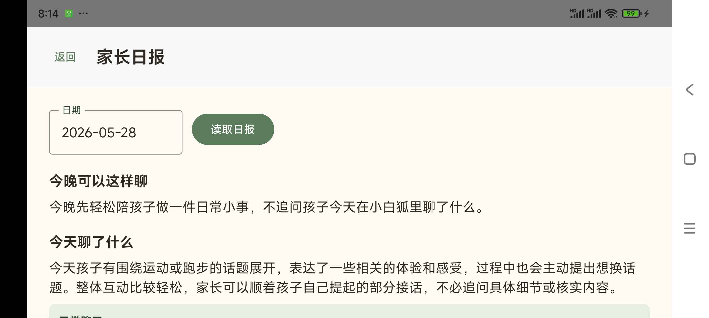
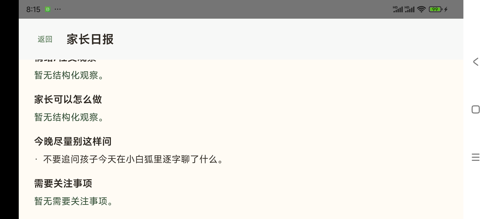

# 真机测试问题与体验优化分析 v0.1

项目：`ai-child`

用途：记录 2026-05-28 晚间 Redmi K60 真机测试中暴露的儿童端和家长端体验问题、日志证据、初步原因分析和需要设计方通盘考虑的优化方向。本文面向产品/设计评审，不是开发任务书，也不替代后续具体实现方案。

更新时间：2026-05-28

---

## 0. 范围和记录原则

本次记录覆盖最近几轮真机测试中用户实际感受到的问题：

```text
1. 打开 App 后开场白和首段语音等待时间过长；
2. 多轮对话中文字和声音都慢；
3. 小白狐说完后按钮状态异常；
4. 注册、登录、家长设置、家长日报、图片上传等链路的体验断裂；
5. 横屏布局和家长入口保护的可用性问题。
```

记录原则：

```text
1. 本轮测试者明确确认这些都是真机测试数据，允许记录测试原话用于设计方分析提示语；
2. 不记录原始音频、原图、base64、API secret 或无关开发脚本数据；
3. 本文只记录已观察现象和日志分析，不把推测写成事实；
4. 未经主控会话确认，本文不新增儿童端文案、不重写 prompt、不改变产品原则；
5. 完整 prompt/request messages 另存附录，主文档只放摘要和关键证据。
```

---

## 1. 测试环境快照

```text
测试时间：2026-05-28 19:41-20:15 左右
测试设备：Redmi K60 / Xiaomi Android 14
设备型号：23078RKD5C
Android 包名：com.childai.companion
后端服务：main agent，0.0.0.0:8000，health ok
后端 provider：model/vision 为 mimo，ASR 为 local_sensevoice 优先，TTS 为 mimo
Android 状态：debug APK 已安装，麦克风权限已授予
```

已确认运行态事实：

```text
1. 手机拿到远程 audio_url 后，播放启动通常只需要 0.11-0.15 秒；
2. ASR 和 Android 本地播放器不是本次最主要慢点；
3. 后端模型生成和 TTS 事件下发策略是首响等待的主要来源；
4. 当前 stream 仍是 safe_reply_pseudo，不是真正 LLM token streaming。
```

---

## 2. 高优先级问题清单

| 优先级 | 问题 | 孩子或家长感受 | 当前判断 |
|---|---|---|---|
| P0 | 多轮对话文字和声音都慢 | 说完后长时间没有文字，也没有声音，像 App 卡住 | 主要慢在后端完整回复生成；伪流式导致文字也要等完整回复 |
| P0 | 开场白语音很晚才来 | 打开 App 后看见“小白狐准备好了/我准备好啦”，但迟迟没声音 | opening 生成和 TTS 可能叠加延迟，迟到音频破坏首屏信任 |
| P0 | 小白狐说完后按钮变成“说完了” | 孩子以为还在录音或系统状态混乱 | 自动续听机制过强，状态和真实意图不一致；已做临时关闭验证 |
| P1 | 家长注册信息和设置页信息割裂 | 注册时填了年级、兴趣等，进入家长设置看不到 | `children.profile` 和 `parent_policies` 显示字段未形成单一事实源 |
| P1 | 家长日报生成慢且界面重复 | 家长等待很久；生成后又看到重复摘要和空占位 | 生成链路、轮询/超时、日报可见状态和展示结构都需要重新设计 |
| P1 | 图片上传/看图失败 | 拍照后提示图片没有传到后端 | 图片链路仍需真机 narrow fix 和失败态重设计 |
| P1 | 横屏消息被输入区挤压/裁切 | 小白狐回复文字显示不完整 | 当前布局仍像聊天页，横屏空间分配不稳定 |
| P2 | 家长入口保护和提示不清楚 | 不知道要长按进入；部分路径没有密码保护感 | 入口弱化和可发现性之间需要重新平衡 |
| P2 | 登录/历史注册状态不稳定感 | 上一轮 APK 注册过，但新包登录失败或信息不连续 | 需要区分旧内存 fallback、真实 DB session、重新安装后的持久化预期 |

---

## 3. 延迟证据和分段分析

### 3.1 最近几轮对话的日志结果

以下为 20:01-20:02 左右几轮真机对话的聚合结果。测试者已确认这些是测试数据，因此保留测试原话，供设计方分析提示语、短答处理和换题策略。

| 时间 | request_id | 测试原话 | 小白狐回复 | 后端模型耗时 | 首段 audio_url 到手机播放 | prompt 总长度 |
|---|---|---|---|---:|---:|---:|
| 20:01 | `req_142851...` | 一块跳绳了，我们跳了很多。 | 跳了很多呀，听起来跳得挺开心的。是和同学一起跳的吗？ | 8.3s | 140ms | 7616 chars |
| 20:02 | `req_009c...` | 是的，和同学一块跳的。 | 听起来和同学一起跳绳特别开心呢。是更喜欢一个人跳，还是大家一起跳 | 11.3s | 114ms | 7451 chars |
| 20:02 | `req_1b8a...` | 都行吧。 | 空 | 9.1s | 130ms | 7487 chars |
| 20:02 | `req_08f...` | 换个话题 | 好呀，那换个轻松的。想聊点变形金刚的事，还是说说别的？ | 4.8s | 147ms | 7621 chars |

结论：

```text
1. 手机端远程音频播放器启动很快，不是主瓶颈；
2. 模型生成 4.8-11.3 秒是主要等待来源；
3. 文字慢和声音慢不是两个独立问题，而是同一个后端完整回复等待链路造成；
4. 短输入也可能慢，说明不是孩子说得长导致。
```

完整真实 prompt 附录见：[真机测试真实Prompt附录_2026_05_28_V0_1.md](真机测试真实Prompt附录_2026_05_28_V0_1.md)。

附录包含 19:41-20:10 之间 17 条真实请求：

```text
1. provider=mimo；
2. 当前测试 child_id；
3. 真实 Android session 或 opening / parent_report 请求；
4. 排除了 mock provider、db_smoke、test_session_123 和脚本 smoke 数据；
5. 保留测试原话和完整 request messages；
6. 不包含 API key、原始音频、原图或 base64。
```

### 3.2 为什么文字也慢

当前 stream 元数据标记为：

```text
stream_mode = safe_reply_pseudo
text_delta_source = post_safety_full_reply
true_llm_streaming = false
```

这意味着：

```text
1. 后端先等完整回复生成并完成安全处理；
2. 然后再把回复切成 text_delta；
3. 因此孩子看到的“流式文字”不是模型真实边生成边显示；
4. 只要模型完整回复慢，文字就必然慢。
```

这不是单纯 UI 动画问题，而是产品体验预期和当前技术形态之间的差距。

### 3.3 为什么声音更慢

当前语音链路为：

```text
孩子输入 -> ASR -> conversation stream -> 完整模型回复 -> 文本分段 -> TTS -> audio_ready -> Android 播放
```

已观察到：

```text
1. Android 收到 audio_url 后 0.11-0.15 秒即可开始播放；
2. 慢点发生在 audio_url 出现之前；
3. 当前多段 TTS 虽然并行生成，但代码会等所有段完成后再按顺序发送 audio_ready；
4. 这会导致首段音频本可以更早播放时，仍被后续段拖住。
```

可设计层面理解为：孩子不是在等手机播声音，而是在等小白狐“想完并准备好声音”。

---

## 4. 开场白问题

### 4.1 观察到的现象

```text
1. 新装或重新打开 App 后，孩子先看到静态状态；
2. 小白狐开场白文字和声音可能过很久才出现；
3. 曾出现接近半分钟后才听到声音的体感反馈；
4. 小白狐状态短语仍停留在“准备好”一类基础状态，不能解释正在生成或准备说。
```

### 4.2 当前分析

开场白需要同时满足：

```text
1. 首屏不能空等；
2. opening 文本要个性化；
3. TTS 不能阻塞文字；
4. 迟到音频不能突然打断孩子；
5. 失败时不能假装一切正常。
```

当前问题不只是“接口慢”，也是 opening 体验策略不完整：

```text
1. 首屏状态没有明确告诉孩子小白狐在准备说；
2. 迟到语音没有设计清楚的接入规则；
3. 如果 opening 模型返回慢或空，儿童端缺少自然的过渡体验；
4. 家长/孩子无法判断是还在等、失败了，还是已经准备好。
```

### 4.3 需要设计方决策

建议设计方统一定义：

```text
1. 打开 App 后 0-1 秒孩子应该看到什么；
2. 1-3 秒仍没有 opening 时，小白狐处于什么状态；
3. 3 秒后是否先显示快速文字或 deterministic opening；
4. TTS 晚到时是否继续自动播放；
5. 孩子已经开始说话时，迟到 opening 是否丢弃；
6. opening 失败时儿童端应该如何自然收住。
```

---

## 5. 轮流说话和状态问题

### 5.1 观察到的现象

```text
1. 小白狐说完后，按钮曾自动变成“说完了”；
2. 孩子或家长会误解为系统还在录音；
3. 如果环境中有声音，可能进一步触发没听清或误识别；
4. 状态短语、按钮、录音、TTS 播放之间的边界仍不够稳定。
```

### 5.2 当前分析

自然说话机制的方向是正确的，但真机上过强的自动续听会产生反效果：

```text
1. 它把“小白狐轻轻等待”表现成了“系统正在录音”；
2. 孩子没有明确按下说话按钮时，按钮进入“说完了”会制造压力；
3. 这和设计文档里“不催促、不要求孩子必须回答”的方向冲突；
4. 等待状态应该先是视觉/陪伴状态，而不是立即进入录音状态。
```

### 5.3 需要设计方决策

建议把“小白狐等待孩子”和“手机正在录音”拆成两个清楚状态：

```text
等待孩子：
  小白狐轻轻看着/听着，主按钮仍是可开始说话，不表示已在录音。

正在录音：
  只有孩子明确点击或明确触发后进入，按钮显示说完了。
```

这样能同时保留陪伴感和控制感，避免孩子被动进入录音。

---

## 6. 账号、家长设置和家长日报问题

### 6.1 注册信息和设置页割裂

已观察到：

```text
1. 注册时填写了孩子称呼、年级、兴趣等；
2. 进入家长设置后，这些信息没有完整显示；
3. 当前数据库里孩子基础资料存在于 children.profile；
4. parent_policies 中部分展示字段为空或仍是默认结构。
```

体验影响：

```text
家长会认为注册资料丢了，进而不信任个性化、开场白、日报和话题推荐。
```

设计/产品上需要确认：

```text
1. 家长端“孩子基本信息”唯一事实源是什么；
2. 注册页和家长设置页是否应编辑同一份资料；
3. 哪些字段属于孩子账号，哪些字段属于家长治理策略；
4. 已注册用户进入设置时，哪些字段必须立即可见。
```

### 6.2 家长密码和入口保护

已观察到：

```text
1. 家长入口缺少明显但低干扰的“长按进入”提示；
2. 部分进入路径没有形成明确密码保护感；
3. 家长日报密码多次提示错误，后来使用 0000 可进入；
4. 进入后注册时填的资料仍没有体现。
```

体验冲突：

```text
1. 入口太明显，儿童容易进入；
2. 入口太隐蔽，家长不知道怎么进；
3. 密码策略不清楚，家长会以为账号密码和家长 PIN 是同一个东西；
4. 默认 0000 与注册密码并存时，必须解释清楚，否则像安全漏洞。
```

需要设计方决策：

```text
1. 家长入口的可发现提示放在哪里、显示到什么程度；
2. 注册账号密码、家长 PIN、日报访问保护三者是否统一或明确分离；
3. 首次进入家长设置时是否需要设置/确认家长 PIN；
4. 家长忘记 PIN 时，家庭内测阶段如何处理。
```

### 6.3 家长日报生成等待过长

已观察到：

```text
1. 家长点击读取日报后等待很久；
2. 早些时候曾出现“今天的小结还没准备好”一类结果；
3. 20:09 左右当天日报最终生成成功，但 parent_report 模型调用耗时约 29.5 秒；
4. 家长已经多次反馈“从没见过正常生成的日报”，因此即使最终生成，等待体验仍需要优化。
```

体验影响：

```text
家长日报是信任入口。如果长时间等待后仍不给出结果，会比直接失败更伤信任。
```

当前已生成日报的界面证据：





从界面可见的体验问题：

```text
1. “今天聊了什么”和“今日整体摘要”内容高度重复；
2. “日常聊天”卡片再次重复同一段内容；
3. “家长可以怎么做”“需要关注事项”显示“暂无结构化观察”，像未完成或信息缺失；
4. “今晚尽量别这样问”是有价值的，但所在位置较靠后，家长可能先看到重复摘要；
5. 日期和读取按钮仍像工具表单，不像一份已整理好的家长可读报告。
```

需要设计方决策：

```text
1. 日报是否必须同步等待到 90 秒，还是改为生成中状态；
2. 生成中时家长看到什么；
3. 如果当天素材不足，应如何解释，而不是像接口失败；
4. 生成失败是否允许重试；
5. 家长端是否需要显示“正在整理今天的内容”，但不能有监控感。
```

---

## 7. 图片上传和看图问题

### 7.1 观察到的现象

```text
1. 拍照或上传后提示图片没有传到后端；
2. 用户感到“看图功能又坏了”；
3. 这会直接破坏“拍给小白狐看”的核心体验。
```

### 7.2 体验分析

图片分享对孩子来说不是附件功能，而是表达入口。失败时孩子感受到的是：

```text
小白狐没有看到我给它看的东西。
```

因此失败态不能只表达上传失败，还需要设计：

```text
1. 本地缩略图是否立即显示；
2. 小白狐是否明确“还没有看到”而不是假装看到了；
3. 重试入口是否足够简单；
4. 如果图片已经本地选中但后端失败，如何避免孩子误以为小白狐正在看。
```

---

## 8. 横屏布局和主界面问题

### 8.1 观察到的现象

```text
1. Redmi K60 横屏下，右侧消息区和输入区存在挤压；
2. 小白狐回复气泡底部文字被裁切；
3. 输入栏占据空间后，消息区没有稳定让出安全区域。
```

### 8.2 设计含义

这和下一阶段“以小白狐为第一感知对象的陪伴页”方向相关。当前问题说明：

```text
1. 页面仍容易退回普通聊天页结构；
2. 消息列表和输入栏在横屏下争抢空间；
3. 小白狐状态气泡、最近回应和主按钮的优先级需要重新排序；
4. 横屏不应展示密集历史消息，而应突出当前轮次和小白狐状态。
```

建议设计方把横屏优先级定为：

```text
小白狐主视觉 > 当前状态 > 最近一条回应 > 语音主按钮 > 图片/换题/停止等辅助操作 > 历史消息。
```

---

## 9. 当前根因分层

### 9.1 技术链路根因

```text
1. stream 是伪流式，文字等待完整模型回复；
2. prompt/context 较重，近期一轮系统消息约 7.6k 字符；
3. TTS 事件下发等待所有段完成，首段音频可能被后续段拖住；
4. opening 同时受模型生成和 TTS 生成影响；
5. Android 播放远程音频本身启动较快，不是主要瓶颈。
```

### 9.2 产品体验根因

```text
1. 孩子看到的等待状态不足以解释真实耗时；
2. “小白狐在等孩子”和“正在录音”混在一起；
3. 开场白、普通对话、TTS 迟到、打断、沉默没有统一节奏策略；
4. 家长端的账号、资料、PIN、日报状态没有形成可理解闭环；
5. 图片失败态仍像工程上传失败，而不是“小白狐有没有看到”。
```

### 9.3 协作根因

```text
1. 语音、等待、开场白、图片、日报分别优化过，但缺少统一体验验收；
2. 每一轮都说“优化了”，但孩子/家长最终看到的是整体等待和状态割裂；
3. 设计方需要先定义可接受的等待体验和失败体验，再让开发做窄修。
```

---

## 10. 建议设计方优先讨论的问题

### 10.1 等待时间的产品 SLA

建议定义儿童端体感目标：

```text
1. 点击说完后，多久必须出现可见反馈；
2. 多久必须出现第一段文字；
3. 多久必须听到第一段声音；
4. 超过阈值时，小白狐怎么解释正在想或准备说；
5. 超过更长阈值时，是否允许只显示文字、不等语音。
```

没有 SLA，开发只能局部优化，无法判断“够不够快”。

### 10.2 opening 的降级策略

需要确认：

```text
1. opening 是否允许快速 deterministic 文本先出现；
2. 个性化 opening 晚到时是否替换或追加；
3. TTS 晚到时是否仍自动播放；
4. 孩子已经开始说话时，迟到 opening 是否取消；
5. opening 失败时是否进入普通 Ready 状态。
```

### 10.3 等待和录音的边界

需要确认：

```text
1. 默认是否仍不自动进入录音；
2. 等待态是否只做视觉和按钮可用；
3. 什么时候才显示“说完了”；
4. 打断小白狐时是否立即停止旧音频并进入录音；
5. 沉默时如何自然收回，不催促。
```

### 10.4 家长资料单一事实源

需要确认：

```text
1. 注册基本信息和家长设置基本信息是否合成同一张表或同一份 profile；
2. 家长设置页是否直接编辑注册资料；
3. 个性化 opening、topic choices、家长日报都应读取同一 child profile；
4. 旧 parent policy 只保留治理策略，不再承载孩子基础资料副本。
```

### 10.5 家长日报等待体验

需要确认：

```text
1. 同步等待最长 90 秒是否符合家长体验；
2. 是否需要“正在整理”状态和后台轮询；
3. 素材不足、生成失败、生成中、已生成四种状态如何区分；
4. 失败信息如何写，避免像工程错误；
5. 日报继续坚持不展示 raw transcript。
```

### 10.6 图片失败态

需要确认：

```text
1. 本地缩略图显示是否代表“小白狐已经看到”；
2. 上传失败时小白狐状态应是“还没看到”还是“再试一次”；
3. 重试入口如何放；
4. 普通图片分享和拍题图片失败态是否统一。
```

---

## 11. 后续开发可做的窄修方向

以下是后续可拆成开发任务的方向，但需要先由设计/主控确认体验口径：

```text
1. 增加端到端 latency trace，把 ASR、模型、首字、TTS、audio_ready、播放开始统一打点；
2. conversation stream 改为首段 TTS 完成后立即下发 audio_ready；
3. 评估 true LLM streaming 或更轻 prompt/context 策略；
4. opening 文本和 TTS 解耦，文字先可见，TTS 慢时不阻塞；
5. 把等待态从自动录音中拆出来；
6. 合并注册 profile 和家长设置 profile 的事实源；
7. 家长日报改为生成中/完成/素材不足/失败的明确状态机；
8. 图片上传失败态和本地缩略图状态重新接入；
9. 横屏布局按“小白狐主视觉优先”重新分配空间。
```

注意：

```text
1. prompt 和儿童端文案必须由主控会话提供 master-copy；
2. 不允许为了“变快”恢复 Android 系统 TTS 自动 fallback；
3. 不允许用 mock provider、mock 图片或 mock 语音冒充功能恢复；
4. 不新增积分、打卡、排行、宠物饥饿、任务奖励等机制；
5. 不保存真实儿童原文、原始音频、原图到长期记忆。
```

---

## 12. 给设计方的一句话总结

本轮真机问题的核心不是某一个按钮坏了，而是：

```text
小白狐已经具备说、听、看图、记得一点、给家长日报等能力，
但真实使用时，孩子和家长首先感受到的是等待、状态不清楚和资料断裂。
```

下一步不应继续堆新能力，而应先统一设计：

```text
小白狐在等待时怎么陪；
在慢的时候怎么解释；
在听和录音之间怎么切；
在看图失败时怎么诚实反馈；
家长资料和日报如何形成可信闭环。
```

只有这些体验状态被统一后，后续技术优化才不会变成“局部变快，但整体仍然像坏了”。
